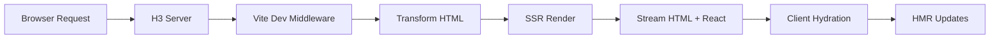
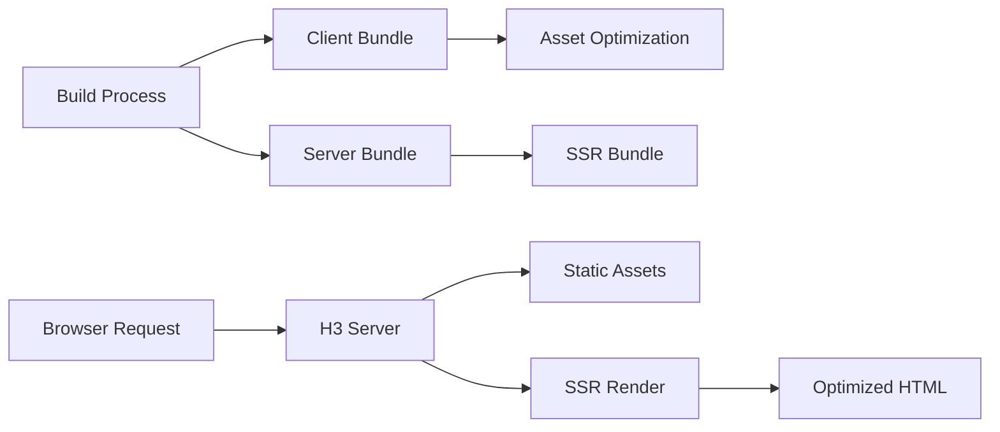

# H3 + Vite SSR

A modern React Server-Side Rendering (SSR) foundation built with [H3](https://github.com/unjs/h3) and [Vite](https://vite.dev/). This project provides a clean, production-ready setup with code splitting, CSS modules, and optimized builds.

## ✨ Features

- 🚀 **React 19** with TypeScript
- ⚡ **Vite** for lightning-fast development
- 🔧 **H3** for the server runtime
- 🎯 **Server-Side Rendering** with `renderToPipeableStream`
- 📦 **Code Splitting** - automatic JS and CSS chunking
- 🎨 **CSS Modules** with separate chunks for dynamic components
- 📊 **Request Logging** (toggleable with env var)
- 🏗️ **Modular Architecture** - clean separation of concerns
- 🔄 **Hot Module Replacement** in development
- 📱 **Production Optimized** builds
 - 🔌 **Native Vite SSR integration** (dev uses `ssrLoadModule`; prod uses built `index.html`)
 - 🧩 **Vite Environments API ready** (used in config; optional for future expansion)

## 🚀 Quick Start

```bash
# Install dependencies
pnpm install

# Development server (with HMR)
pnpm dev

# Build for production
pnpm build

# Start production server
pnpm start
```

### Optional: Enable Request Logging

```bash
# Development with logging
ENABLE_LOGGING=true pnpm dev

# Production with logging  
ENABLE_LOGGING=true pnpm start
```

## 📁 Project Structure

```
├── src/
│   ├── components/
│   │   ├── DynamicButton.tsx          # Dynamically imported component
│   │   └── DynamicButton.module.css   # CSS module (chunked separately)
│   ├── entries/
│   │   └── admin/
│   │       └── AdminApp.tsx           # Example per-route component mounted at /admin
│   ├── App.tsx                        # Main React app (default)
│   ├── entry-client.tsx               # Client hydration entry
│   └── entry-server.tsx               # SSR entry (loaded in dev/prod)
├── server/
│   ├── index.ts                       # Server entry point
│   ├── app.ts                         # App creation & middleware setup
│   ├── middleware/
│   │   ├── logging.ts                 # Request logging middleware
│   │   └── static.ts                  # Node.js → H3 middleware adapter
│   ├── ssr/
│   │   └── renderer.ts                # SSR rendering logic
│   └── utils/
│       └── entries.ts                 # URL → component mapping from frontier config
├── plugins/
│   └── get-frontier-entrypoints.ts    # Vite virtual module for dynamic imports (optional)
├── frontier.config.yaml               # Declares available component entrypoints
├── index.html                         # HTML template (dev) → emits .output/client/index.html (prod)
├── vite.config.ts                     # Vite config (environments + SSR)
└── package.json
```

## 🔄 How It Works

### Development Mode (`pnpm dev`)



1. **H3 Server** starts on port 3000
2. **Vite middleware** handles asset transformation and HMR
3. **SSR renderer** server-renders React components
4. **HTML streaming** delivers initial content fast
5. **Client hydration** makes the page interactive
6. **Hot Module Replacement** updates code without refresh

### Production Mode (`pnpm build && pnpm start`)



**Build Process:**
1. **Client build** → Optimized JS/CSS chunks and `index.html` in `.output/client/`
2. **Server build** → SSR entry bundle in `.output/server/entry-server.js`
3. **Runtime server build** → h3 server at `.output/server/index.js`

**Runtime:**
1. **Static assets** served from `.output/client` with compression
2. **SSR rendering** imports `.output/server/entry-server.js`
3. **Asset links** come from built `.output/client/index.html` (no manual injection)

## 🏗️ Critical Architecture Pieces

### 1. **Server Structure**

- **`server/index.ts`** - Minimal entry point, starts the server
- **`server/app.ts`** - Core app setup, middleware orchestration
- **`server/ssr/renderer.ts`** - Handles React SSR with streaming
- **`server/middleware/static.ts`** - **Critical adapter** for Node.js middleware

> 🚨 **Why `static.ts` is essential:** H3 uses event-based handlers, but Vite dev server and production static file serving use Node.js middleware. This adapter bridges the gap - without it, nothing works.

### 2. **Entry Points**

- **`src/entry-server.tsx`** - SSR entry, exports `render()` function
- **`src/entry-client.tsx`** - Client hydration entry with CSS imports

### 3. **Code Splitting Magic**

The build automatically creates separate chunks:

```bash
# Production build output
.output/client/assets/
├── react-[hash].js        # React/ReactDOM bundle (11.5kb)
├── main-[hash].js         # Main app code (176kb) 
├── DynamicButton-[hash].js # Dynamic component (0.6kb)
├── main-[hash].css        # Main styles (1.4kb)
└── DynamicButton-[hash].css # Dynamic component styles (0.9kb)
```

### 4. **Asset Handling**

In production, the server reads `.output/client/index.html` as the template. Asset and CSS links are already included by Vite. No custom manifest parsing or manual injection is needed. The SSR manifest is still emitted and can be used later for advanced preload directives if desired.

## 🎯 Key Commands

| Command | Environment | Description |
|---------|-------------|-------------|
| `pnpm dev` | Development | Vite dev server with SSR + HMR |
| `pnpm dev:log` | Development | Same as above with request logging |
| `pnpm build` | Build | Builds client, SSR entry, and server runtime |
| `pnpm start` | Production | Runs production server from `.output/` |
| `pnpm start:log` | Production | Same as above with request logging |

## 🚦 Production Deployment

After `pnpm build`, deploy the project with:

```bash
PORT=8080 pnpm start
```

This runs `.output/server/index.js`, which serves static files from `.output/client` and uses `.output/server/entry-server.js` for SSR.

## 🔧 Configuration

### Environment Variables

- `NODE_ENV=production` - Enables production mode
- `PORT=3000` - Server port (default: 3000)
- `ENABLE_LOGGING=true` - Enables request logging

### Customization

- **Add middleware:** Modify `server/app.ts`
- **Change SSR logic:** Edit `server/ssr/renderer.ts`
- **Adjust build:** Update `vite.config.ts`
- **Add routes:** Extend the `*` handler in `server/app.ts`

## 🤔 Why This Stack?

- **H3**: Lightweight, fast, framework-agnostic server
- **Vite**: Superior DX with instant HMR and optimized builds  
- **React 19**: Latest features with improved SSR streaming
- **TypeScript**: Type safety across client and server
- **CSS Modules**: Scoped styles with automatic chunking

This combination provides the performance of custom SSR with the developer experience of modern tooling.

## 📚 Learn More

- [H3 Documentation](https://h3.unjs.io/)
- [Vite SSR Guide](https://vite.dev/guide/ssr)
- [Vite Environment API](https://vite.dev/guide/api-environment.html#environment-api)
- [React 18+ SSR](https://react.dev/reference/react-dom/server)
- [CSS Modules](https://github.com/css-modules/css-modules)

---

Built with ❤️ using modern web technologies